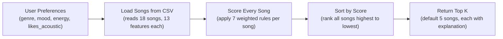

# Music Recommender Simulation

## Project Summary

VibeFinder 1.0 is a content-based music recommender built in Python. Given a user's stated preferences — favorite genre, mood, target energy level, and whether they like acoustic music — it scores every song in an 18-track catalog and returns the top 5 matches, each with a plain-English explanation of why it was chosen.

The system uses seven scoring rules: four core rules controlled by configurable weights (genre match, mood match, energy proximity, acoustic bonus) and three extended rules with fixed weights (mood tag match, popularity boost, decade match). It also supports a diversity filter that prevents the same artist or genre from dominating the results.

This project was built to explore how real-world recommenders work — how raw feature data becomes a ranked list, where the design choices create bias, and what happens when user preferences don't match what's in the catalog.

---

## How The System Works



- **User Preferences** — the user supplies their favorite genre, mood, target energy (0–1), acoustic preference, mood tag, and preferred decade.
- **Load Songs from CSV** — the catalog is read from `data/songs.csv`; numeric fields are type-converted on load.
- **Score Every Song** — seven rules fire per song and points are summed into a single score.
- **Sort by Score** — all 18 scored songs are ranked from highest to lowest.
- **Return Top K** — the top 5 are returned, each with its score and a comma-separated list of the rules that fired.

---

## Getting Started

### Setup

1. Create a virtual environment (optional but recommended):

   ```bash
   python -m venv .venv
   source .venv/bin/activate      # Mac or Linux
   .venv\Scripts\activate         # Windows
   ```

2. Install dependencies:

   ```bash
   pip install -r requirements.txt
   ```

3. Run the recommender:

   ```bash
   python -m src.main
   ```

### Running Tests

```bash
pytest
```

Additional tests can be added in `tests/test_recommender.py`.

---

## Experiments You Tried

**Genre weight reduction (2.0 → 1.0 with energy doubled to ×2.0)**
Gym Hero dropped from #2 to #3 for the Happy Pop Fan profile. It had a genre match that was propping it above Rooftop Lights despite a worse energy fit. Once the energy multiplier doubled, Rooftop Lights (energy 0.76, much closer to the target of 0.8) overtook it. This confirmed that the default +2.0 genre weight can override meaningful energy differences.

**Three scoring mode presets (Genre First / Mood First / Energy Focused)**
Running Happy Pop Fan through all three modes showed how differently the same catalog feels depending on what you weight. In Mood First mode, Rooftop Lights jumped to #2 because it matched the "happy" mood — something the standard weights buried at #3 because Gym Hero's genre match outscored it. In Energy Focused mode, the top 5 spread out noticeably and songs without a genre match still scored competitively.

**Adversarial profiles (Conflicted Listener and Genre Ghost)**
The Conflicted Listener (jazz/happy/high-energy) exposed how genre weight dominates: both jazz songs ranked #1 and #2 despite having energy around 0.45 against a target of 0.9, and neither matched the happy mood. The Genre Ghost (country/focused/0.5 energy) showed the silent fallback problem — country doesn't exist in the catalog, so the system gave every song zero genre points and returned a genre-incoherent top 5 with no warning.

**Diversity filter on vs. off**
With the filter off, Neon Echo appeared twice in the Happy Pop Fan top 5 (Sunrise City at #1 and Night Drive Loop at #4). With the filter on, Night Drive Loop was removed and Midnight Coding entered at #5, bringing in a new artist and genre. The filter worked correctly but had limited impact because the catalog is small enough that artist repetition only appeared once in the top 5.

---

## Limitations and Risks

- **Tiny catalog.** 18 songs is too few for genre-based scoring to be meaningful across all user types. Genres like metal and country have one or zero songs respectively, so users who prefer them get either one result propped to the top by genre weight alone, or no genre matches at all.
- **Genre weight is too influential.** The +2.0 genre bonus is twice the maximum energy score and double the mood bonus. A song with the right genre tag will almost always outrank songs with better energy and mood fits. This creates a system that rewards label-matching over feel-matching.
- **No context awareness.** The system has no concept of time of day, activity, or listening history. It treats a user the same whether they are studying, commuting, or working out.
- **Silent failures.** When a user's preferred genre, mood tag, or decade has no matches in the catalog, the affected scoring terms silently contribute zero. There is no feedback to the user that part of their preference was ignored.
- **Linear energy scoring.** A song 0.1 away from the target and one 0.8 away are penalized proportionally, not exponentially. Songs far from the target stay unreasonably competitive.

See [`model_card.md`](model_card.md) for a full analysis.

---

## Reflection

Building this project made the gap between "a rule that seems reasonable" and "a rule that behaves well" feel concrete. Assigning +2.0 to genre match seemed intuitive at the start — genre is a strong signal — but the adversarial profiles showed how quickly it breaks down when the catalog is small or when a user's taste doesn't map cleanly onto a single genre label.

The most surprising result was how much the system's output can feel like a real recommendation even when the underlying logic is just arithmetic. For well-represented profiles like Chill Lofi and Happy Pop Fan, the top 5 lists felt genuinely appropriate — not because the algorithm is sophisticated, but because the features (energy, mood, genre) were designed by humans who already understood musical taste. The hard work happened before the code, in deciding which features to include.

For a deeper analysis of strengths, limitations, and bias, see the [**Model Card**](model_card.md).

---

## Personal Reflection

**What was your biggest learning moment?**
The biggest learning moment was running the "Conflicted Listener" profile and watching the system surface two jazz songs with confidence even though neither matched the user's mood or energy preferences. It made the problem of over-weighting a single feature feel real rather than theoretical — you could see exactly which number caused the bad result and trace it back to a design decision.

**How did AI tools help you, and when did you need to double-check them?**
AI tools were helpful for thinking through edge cases and generating realistic song data quickly. The most important moment to double-check was after the weight experiment: the output showed Gym Hero and Rooftop Lights swapping ranks, and it would have been easy to accept that as correct without verifying the underlying scores manually to confirm the swap made sense given the energy values.

**What surprised you about how a simple algorithm can still feel like a recommendation?**
It was surprising how much the results "felt right" for profiles like Chill Lofi and Happy Pop Fan, even though the algorithm is only four arithmetic rules. The energy proximity score in particular does a lot of invisible work — even without any learning or history, songs that match your target energy tend to feel appropriate, which suggests the human intuition behind the features matters more than the sophistication of the model.

**What would you try next if you extended this project?**
The most interesting next step would be adding a second scoring pass that penalizes repetition in the top-K results — right now all five recommendations could be from the same genre. A diversity constraint that ensures at least two distinct genres appear in the top five would make the recommendations feel less monotonous while still being score-driven.
