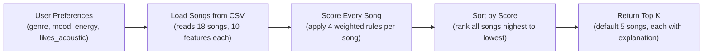

# 🎵 Music Recommender Simulation

## Project Summary

In this project you will build and explain a small music recommender system.

Your goal is to:

- Represent songs and a user "taste profile" as data
- Design a scoring rule that turns that data into recommendations
- Evaluate what your system gets right and wrong
- Reflect on how this mirrors real world AI recommenders

Replace this paragraph with your own summary of what your version does.

---

## How The System Works



Each step in plain language:
- **User Preferences** — the user supplies their favorite genre, mood, a target energy level (0–1), and whether they prefer acoustic music.
- **Load Songs from CSV** — the catalog is read from `data/songs.csv` into memory; numeric fields are converted from strings to numbers.
- **Score Every Song** — four rules fire per song: genre match (+2.0), mood match (+1.0), energy proximity (up to +1.0), and acoustic bonus (+0.5 if applicable). Points are added up to produce a single score.
- **Sort by Score** — all 18 scored songs are ranked from highest to lowest using a stable sort.
- **Return Top K** — the top 5 (or however many K specifies) are returned, each bundled with its score and a comma-separated list of the rules that fired.

---

## Getting Started

### Setup

1. Create a virtual environment (optional but recommended):

   ```bash
   python -m venv .venv
   source .venv/bin/activate      # Mac or Linux
   .venv\Scripts\activate         # Windows

2. Install dependencies

```bash
pip install -r requirements.txt
```

3. Run the app:

```bash
python -m src.main
```

### Running Tests

Run the starter tests with:

```bash
pytest
```

You can add more tests in `tests/test_recommender.py`.

---

## Experiments You Tried

Use this section to document the experiments you ran. For example:

- What happened when you changed the weight on genre from 2.0 to 0.5
- What happened when you added tempo or valence to the score
- How did your system behave for different types of users

---

## Limitations and Risks

Summarize some limitations of your recommender.

Examples:

- It only works on a tiny catalog
- It does not understand lyrics or language
- It might over favor one genre or mood

You will go deeper on this in your model card.

---

## Reflection

Read and complete `model_card.md`:

[**Model Card**](model_card.md)

Write 1 to 2 paragraphs here about what you learned:

- about how recommenders turn data into predictions
- about where bias or unfairness could show up in systems like this


---

## 7. `model_card_template.md`

Combines reflection and model card framing from the Module 3 guidance. :contentReference[oaicite:2]{index=2}  

```markdown
# 🎧 Model Card - Music Recommender Simulation

## 1. Model Name

Give your recommender a name, for example:

> VibeFinder 1.0

---

## 2. Intended Use

- What is this system trying to do
- Who is it for

Example:

> This model suggests 3 to 5 songs from a small catalog based on a user's preferred genre, mood, and energy level. It is for classroom exploration only, not for real users.

---

## 3. How It Works (Short Explanation)

Describe your scoring logic in plain language.

- What features of each song does it consider
- What information about the user does it use
- How does it turn those into a number

Try to avoid code in this section, treat it like an explanation to a non programmer.

---

## 4. Data

Describe your dataset.

- How many songs are in `data/songs.csv`
- Did you add or remove any songs
- What kinds of genres or moods are represented
- Whose taste does this data mostly reflect

---

## 5. Strengths

Where does your recommender work well

You can think about:
- Situations where the top results "felt right"
- Particular user profiles it served well
- Simplicity or transparency benefits

---

## 6. Limitations and Bias

Where does your recommender struggle

Some prompts:
- Does it ignore some genres or moods
- Does it treat all users as if they have the same taste shape
- Is it biased toward high energy or one genre by default
- How could this be unfair if used in a real product

---

## 7. Evaluation

How did you check your system

Examples:
- You tried multiple user profiles and wrote down whether the results matched your expectations
- You compared your simulation to what a real app like Spotify or YouTube tends to recommend
- You wrote tests for your scoring logic

You do not need a numeric metric, but if you used one, explain what it measures.

---

## 8. Future Work

If you had more time, how would you improve this recommender

Examples:

- Add support for multiple users and "group vibe" recommendations
- Balance diversity of songs instead of always picking the closest match
- Use more features, like tempo ranges or lyric themes

---

## 9. Personal Reflection

A few sentences about what you learned:

- What surprised you about how your system behaved
- How did building this change how you think about real music recommenders
- Where do you think human judgment still matters, even if the model seems "smart"

```

---

## Personal Reflection

**What was your biggest learning moment?**
The biggest learning moment was running the "Conflicted Listener" profile and watching the system surface two jazz songs with confidence even though neither matched the user's mood or energy preferences. It made the problem of over-weighting a single feature feel real rather than theoretical — you could see exactly which number caused the bad result and trace it back to a design decision.

**How did AI tools help you, and when did you need to double-check them?**
AI tools were helpful for thinking through edge cases and generating realistic song data quickly. The most important moment to double-check was after the weight experiment: the output showed Gym Hero and Rooftop Lights swapping ranks, and it would have been easy to accept that as correct without verifying the underlying scores manually to confirm the swap made sense given the energy values.

**What surprised you about how a simple algorithm can still feel like a recommendation?**
It was surprising how much the results "felt right" for profiles like Chill Lofi and Happy Pop Fan, even though the algorithm is only four arithmetic rules. The energy proximity score in particular does a lot of invisible work — even without any learning or history, songs that match your target energy tend to feel appropriate, which suggests the human intuition behind the features matters more than the sophistication of the model.

**What would you try next if you extended this project?**
The most interesting next step would be adding a second scoring pass that penalizes repetition in the top-K results — right now all five recommendations could be from the same genre. A diversity constraint that ensures at least two distinct genres appear in the top five would make the recommendations feel less monotonous while still being score-driven.
